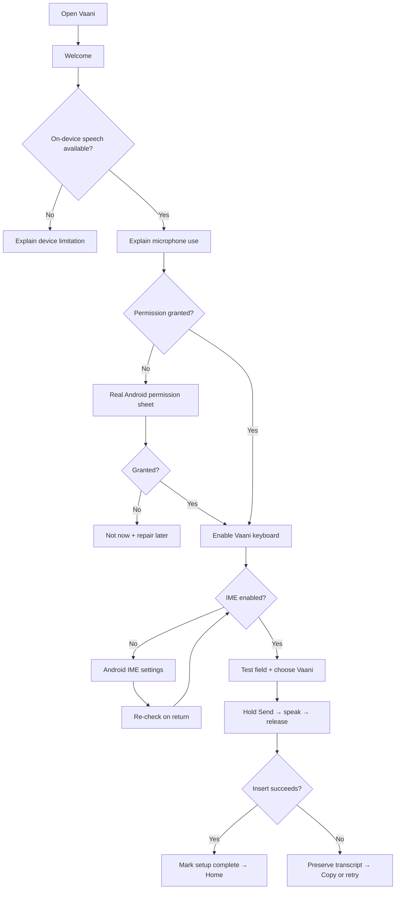
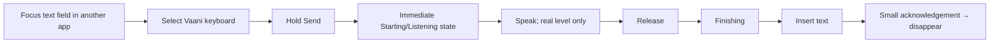
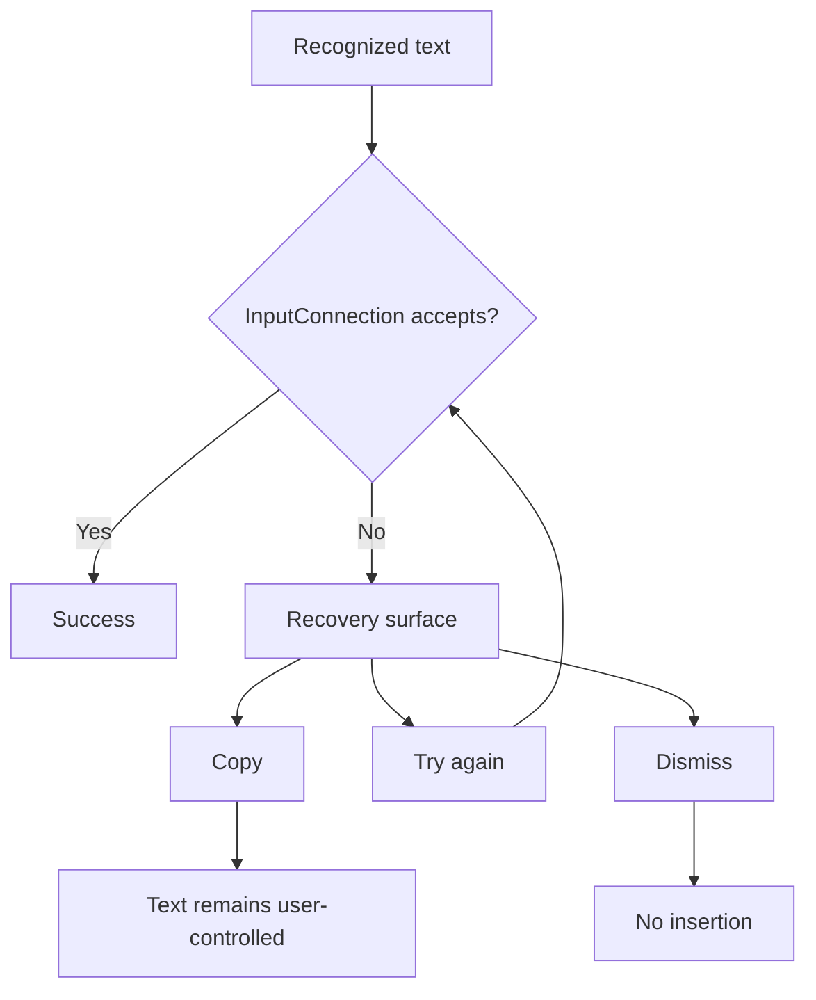

# User flows — Phase 2

## First run (current IME-first V1)

## Returning user

## Failure recovery

## Future coexisting invocation

The future overlay must consume the same `DictationState`, STT boundary, cleanup boundary, and insertion/recovery contract. It must not require a second formatter or a second transcript lifecycle. Its implementation is intentionally not started in this phase.

