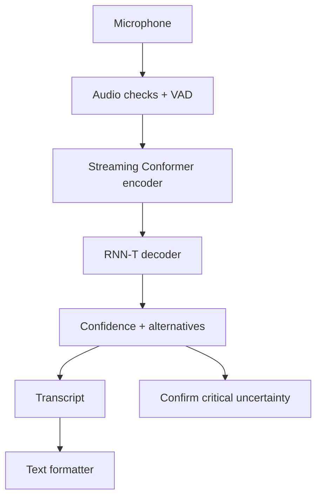
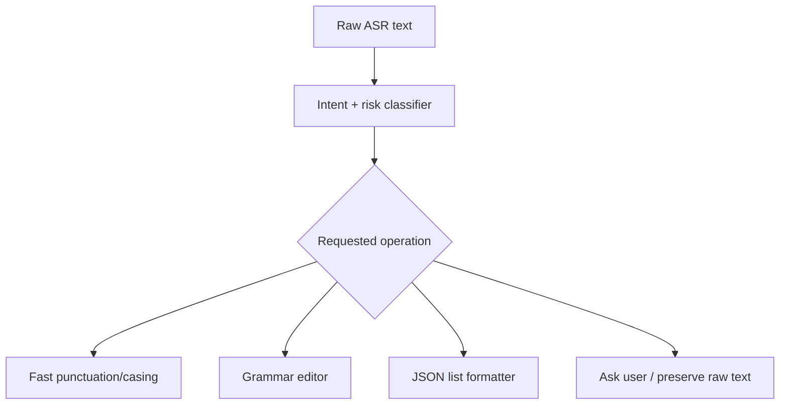

# WhisperFlow Mobile: STT and Text-Intelligence Research Report

**Purpose.** Design a mobile-first, local speech-to-text and text-formatting system that is fast, compact, broad-vocabulary, and as reliable as practical on imperfect microphones and noisy environments.

**Decision in one sentence.** Build a *streaming Conformer-Transducer ASR model* (roughly 40–100M parameters) with a subword tokenizer, domain adaptation, aggressive but realistic audio augmentation, calibrated confidence, and a compact separate text pipeline—an intent classifier plus an editor—not one tiny model asked to do everything.

## 1. The non-negotiable reality

“No word wrong, no word missing, under every mic, gain, noise level, language, accent, and environment” cannot be achieved. Audio can be physically ambiguous: a clipped microphone destroys speech detail; several people can speak at once; a distant word can be below the noise floor; and a name may never have occurred in training. No model can recover information that did not reach the microphone.

This is not pessimism; it changes the product design. The correct goal is **minimum unobserved error**, not a fictional zero-error model. A serious system must:

1. make its best transcript;
2. identify uncertain spans rather than silently inventing text;
3. ask for confirmation or offer alternatives when a word matters;
4. improve from explicitly approved corrections; and
5. measure error by condition, not only on one clean benchmark.

The word error rate (WER) is `(substitutions + deletions + insertions) / reference words`. A 0% WER claim requires perfect output on *every* held-out utterance. It is not a responsible production target. A more useful initial acceptance target is below 6% WER for clean, close-talk English, below 12% for the product’s defined mobile-noise suite, and a low *unflagged critical-token error* rate for names, numbers, commands, and URLs. These are targets to validate, not guarantees.

Whisper demonstrated the value of diverse, large-scale weakly supervised speech data for robustness, but it also illustrates why a transcript must not be treated as ground truth without confidence and review. [Whisper paper](https://arxiv.org/abs/2212.04356)

## 2. What “small vocabulary but large vocabulary” should mean

Do **not** create a giant word-level vocabulary. A word-level model needs an output entry for every spelling, name, product, and inflection; it still fails on unseen words and makes the output layer unnecessarily large.

Use a **subword tokenizer** (SentencePiece unigram or BPE, 1,024–4,096 pieces).

| Requirement | Correct solution |
|---|---|
| Broad/open vocabulary | Compose unseen words from subword pieces |
| Small output layer | 1k–4k subword vocabulary, not 50k+ full words |
| Names and commands | Contextual bias list / shallow-fusion decoder, not retraining for every name |
| Digits, dates, money | Preserve spoken tokens first; apply a separate inverse-text-normalizer with confidence |
| Mixed English/Hindi/Bengali | Language tags and multilingual subword training; evaluate code-switching separately |

Vocabulary size is not the main ASR memory cost. Encoder size, decoder state, activation memory, and decoding strategy matter more. A 2k subword vocabulary is enough to write words not seen as whole units; it is not a promise to spell every rare name correctly.

## 3. Recommended STT architecture

### 3.1 Product architecture



### 3.2 Model choice

Use a **causal / chunked Conformer encoder with an RNN-T (transducer) head**.

- The Conformer combines local convolutional patterns with global attention and is a strong ASR architecture. [Conformer](https://arxiv.org/abs/2005.08100)
- RNN-T is suited to incremental decoding. It produces partial text while the person is talking, unlike a batch-only model that waits for the entire clip.
- Keep right context small (for example 160–320 ms) and use cached left context. This creates a measurable latency budget rather than fake “instant” output.
- Add an auxiliary CTC loss during training. It stabilizes alignment, permits forced alignment for debugging, and provides a useful fallback decoder.
- Prefer a 1,024–2,048 piece SentencePiece model for a single language; use 2,048–4,096 for a deliberately trained multilingual, code-switched model.

For an ultra-small version, a depthwise-separable convolution CTC model (QuartzNet-style) is simpler and CPU-friendly, but it usually gives up some robustness and streaming quality. [QuartzNet](https://arxiv.org/abs/1910.10261)

### 3.3 Two deployable tiers

| Tier | ASR design | Weight size after INT8 | Use case | Honest trade-off |
|---|---:|---:|---|---|
| Lite | 35–50M parameter streaming Conformer-RNN-T | about 35–55 MB | Android CPU/NPU, live notes | Strong in supported conditions; weaker accents/noise and rare terms |
| Quality | 80–120M parameter streaming Conformer-RNN-T | about 80–125 MB | RTX 3050 / newer phones / desktop | Better accuracy; still not universal or perfect |
| Offline retry | 200–600M non-streaming teacher or cloud-optional model | 0.4–1.2 GB quantized, varies | Explicit “improve transcript” action | More latency and memory; never silently overwrite the live transcript |

These are engineering ranges, not vendor benchmark claims. Actual memory must be profiled on the intended phone because runtime buffers, tokenizer, audio pipeline, and KV/cache equivalents add overhead.

### 3.4 Audio front end—what it should and should not do

The front end should standardize audio, not destroy it trying to make it pretty.

- Resample to 16 kHz mono (or train at the actual target rate); use 25 ms windows and 10 ms hop log-Mel features.
- Use a lightweight voice-activity detector with hangover logic. Do not cut a segment solely because a brief syllable falls below a fixed threshold.
- Detect clipping, sustained low signal, wind-like noise, double-talk, and non-speech. Surface these as quality warnings.
- Use automatic gain only when it does not clip. Do **not** normalize every clip blindly: it can raise background noise and ruin signal-to-noise ratio.
- Noise suppression is optional and must be A/B tested. Train with both raw and processed audio; an enhancer can remove consonants or distort a voice.
- Preserve the unprocessed stream for diagnostics/opt-in correction data if privacy rules permit.

The model should be trained to tolerate a distribution of gains; it cannot reconstruct clipped or absent phonetic information.

## 4. Data strategy: minimum data without lying to yourself

There is no “small dataset that covers every condition.” Dataset variety is the core of robustness. The way to reduce custom-data needs is **pretraining plus targeted adaptation**, not pretending 20 hours is enough for universal ASR.

### 4.1 Recommended data mix

| Stage | Data | Minimum useful scale | Why |
|---|---|---:|---|
| Base model | Licensed public/owned speech with transcripts, accents, noise, conversational speech | Start from an existing model; training from scratch normally needs thousands of hours | Learns acoustics and broad language coverage |
| Acoustic adaptation | Your target microphones, rooms, distances, gains, languages | 50–200 well-labelled hours across people and devices | Learns actual deployment distribution |
| Command/name adaptation | Real product phrases, app names, contacts, local terms | 5–20 hours + text bias lists | Reduces high-value domain errors |
| Hard-negative set | Failures collected during test/beta with consent | Ongoing | Prevents repeatedly fixing only easy cases |

Use public corpora only after checking their licenses and consent terms. Useful research benchmarks include [LibriSpeech](https://www.openslr.org/12), [Mozilla Common Voice](https://commonvoice.mozilla.org/en/datasets), [FLEURS](https://huggingface.co/datasets/google/fleurs), and [Speech Commands](https://www.tensorflow.org/datasets/catalog/speech_commands). They are not substitutes for your own microphone and language distribution.

### 4.2 Augmentation recipe

Every training batch should contain clean speech *and* realistic corruption. Suggested starting distribution:

- 30% clean or lightly processed speech;
- 25% additive environmental noise at 0–25 dB SNR, with extra weight at 5–15 dB;
- 15% room impulse responses / reverberation;
- 10% device response, codec, packet loss, or band-limit simulation;
- 10% speed/pitch variation within plausible limits;
- 10% competing speaker or music, carefully labelled as such.

Add clipping, gain variation, far-field distance, wind, echo, and code-switching only if they truly occur in the product. Synthetic augmentation helps only if it resembles deployment. Do not let augmentation replace a held-out real-recording test set.

SpecAugment is a standard feature-space augmentation approach for ASR. [SpecAugment](https://arxiv.org/abs/1904.08779)

### 4.3 Data quality rules

1. Keep speaker, room, microphone, and session identities in metadata.
2. Split train/validation/test by **speaker and recording session**, never random clips. Otherwise the test leaks the speaker/mic characteristics.
3. Create exact transcription conventions for fillers, false starts, laughter, mixed scripts, profanity, digits, and overlapping speech.
4. Double-label a sample of recordings; measure annotator disagreement. Some “model errors” are ambiguous transcripts.
5. Never train on raw user audio without clear opt-in, retention rules, and a deletion path.

### 4.4 Bootstrap plan

Start from a pretrained streaming model. First train only adapters or the prediction/joint layers; then unfreeze the last encoder blocks if validation error proves it is necessary. Fine-tune with a small learning rate and retain broad data in each batch so the model does not forget normal speech.

Self-supervised pretraining is useful where labelled data is scarce, but it still needs broad audio diversity before task fine-tuning. [wav2vec 2.0](https://arxiv.org/abs/2006.11477)

## 5. Making recognition trustworthy, not merely impressive

### 5.1 Confidence is a product feature

The decoder must expose token/word confidence and at least one alternative for low-confidence spans. Calibrate it on your held-out data: when it says 90% confidence, roughly 90% of those words should be correct. Raw neural scores are not calibrated confidence.

Use stricter thresholds for critical entities:

| Token class | Handling |
|---|---|
| Normal prose | Show best transcript, permit later correction |
| Contact/app/person name | Apply contextual bias; highlight low confidence |
| Number, address, date, amount | Preserve spoken form and request confirmation below threshold |
| Command that triggers an action | Require explicit confirmation if transcript confidence or intent confidence is low |
| Audio-quality failure | Say “audio unclear” rather than manufacture plausible words |

### 5.2 Contextual biasing

At decode time, inject a small list of expected terms: contact names, currently open apps, song titles, project names, and commands. It is much cheaper and safer than retraining. Protect against bias hallucinations by limiting its score and disabling it when the acoustic evidence disagrees.

### 5.3 Prevent hallucination

Never let the language model silently rewrite ASR output as if it were acoustic truth. Keep these fields separately:

```json
{
  "verbatim_transcript": "i need buy five cables maybe",
  "formatted_transcript": "I need to buy five cables, maybe.",
  "uncertain_spans": [{"text": "cables", "confidence": 0.58}],
  "normalization_changes": [],
  "formatting_changes": ["capitalization", "punctuation"]
}
```

The UI can show a polished result, but users must be able to recover the raw transcript and see substantive edits. This is essential for notes, commands, legal/medical contexts, and debugging.

## 6. Text intelligence: do not train one “small LLM” for all jobs

Your requested text tasks are actually different problem types:

| Task | Best model class | Why |
|---|---|---|
| Intent classification | Small encoder classifier, 15–60M parameters | Faster, constrained labels, more measurable |
| Punctuation/casing | Token classifier or compact seq2seq, 20–100M | Deterministic output format and low latency |
| Grammar correction | Compact encoder-decoder, 60–220M | Needs generation but has a narrow transformation |
| “Convert into a list when asked” | Intent + structured formatter | Classification selects operation; formatter emits fixed schema |
| Open-ended rewriting | 0.5–1.5B instruction-tuned decoder | More expressive, but slower and less reliable |

For a reliable mobile product, use a **router plus specialist models**:



This beats sending every sentence to a miniature generative LLM. A generic LLM may make elegant but unrequested semantic changes, turn a factual statement into a different statement, or treat an uncertain word as certain.

### 6.1 Recommended text model set

**Router (mandatory).** A 15–60M parameter multilingual encoder with multi-head outputs:

- intent: `transcribe_only`, `punctuate`, `correct_grammar`, `make_list`, `command`, `question`, `exclamation`, `unknown`;
- action risk: `none`, `needs_review`, `needs_confirmation`;
- language/script;
- formatting request: casing, punctuation, bullets, numbering;
- confidence.

**Fast editor (default).** A 60–220M encoder-decoder trained only to preserve meaning while adding casing, punctuation, and grammar. Enforce “minimal edit” by penalizing unnecessary changes and measuring semantic preservation.

**Optional expressive editor.** A 0.5–1.5B instruction model, quantized to 4-bit, only when a user explicitly asks for rewriting or summarizing. This is not the critical path for live transcription.

On-device approximate weight budgets are 20–60 MB INT8 for a classifier, 80–250 MB INT8 for a 60–220M editor, and 300–900 MB at 4-bit for a 0.5–1.5B generative model plus runtime cache. Measure the actual Android runtime; parameter math alone is insufficient.

### 6.2 Output contract

Force every model to produce a validated structure. The system—not the model—decides whether to apply the change.

```json
{
  "operation": "make_list",
  "confidence": 0.96,
  "source_text": "buy milk eggs and charger tomorrow",
  "result": {
    "title": null,
    "items": ["Buy milk", "Buy eggs", "Buy a charger tomorrow"]
  },
  "meaning_changed": false,
  "needs_confirmation": false
}
```

Validate JSON against a schema. Reject malformed output. For grammar/punctuation, use a diff gate: if the editor changes named entities, numbers, units, negation, or more than a defined share of content words, return the raw transcript for review instead of applying it automatically.

### 6.3 Training data for the text system

Do not start by “training an LLM from scratch.” It is wasteful and will be worse than an adapted pretrained encoder/encoder-decoder. Build a precise supervised dataset:

| Dataset slice | Example | Label/output |
|---|---|---|
| ASR-like punctuation | `where are you going` | `Where are you going?` |
| Grammar correction | `she dont know` | `She doesn't know.` |
| Intent | `make this into a checklist` | `make_list` |
| Preserve-only | `NVIDIA RTX 3050 6GB` | exact copy |
| List format | `buy milk bread charger` | JSON list |
| Adversarial | `do not make a list` | preserve intent and negation |
| Code-switching | Hindi/Bengali/English mixed input | agreed script and punctuation policy |

Start with 20k–100k high-quality examples, then add error-focused examples from evaluation. Synthetic examples are useful to create formatting variations, but human review is required for a held-out test set and all safety-critical categories. Small, high-quality task-aligned data can outperform larger mismatched instruction data; QLoRA research also found task/data suitability more important than raw instruction count. [QLoRA](https://arxiv.org/abs/2305.14314)

Fine-tune with LoRA/QLoRA rather than full training. QLoRA keeps the base model frozen in 4-bit form while training adapters, making adaptation feasible on a single modest GPU. It does **not** eliminate the need for good data or testing. [QLoRA details](https://arxiv.org/abs/2305.14314)

## 7. Training and deployment plan

### Phase 0 — Define the product boundary (one week)

- Choose languages, code-switch policy, microphones, distance range, maximum background noise, and offline latency budget.
- Define critical tokens and which commands can perform actions.
- Record a test specification before training. Without this, “accurate” becomes an untestable feeling.

### Phase 1 — Baseline (one to two weeks)

- Run a pretrained streaming ASR model locally on 100–300 representative utterances.
- Log WER, deletion rate, critical-token error, real-time factor, RAM/VRAM, battery/heat, and time-to-first-partial.
- Compare raw audio versus VAD/noise suppression variants. Keep the raw baseline.

### Phase 2 — Data and fine-tuning (two to six weeks)

- Collect consented target recordings across at least 20 speakers, real mics, rooms, and gain settings.
- Label and split by speaker/session/device.
- Adapt the acoustic model; test after each change against the frozen test suite.
- Train the router and text editor separately. Do not let editor training change ASR scoring.

### Phase 3 — Reliability layer (one to three weeks)

- Calibrate confidence per language and noise band.
- Add contextual bias and entity/number confirmation.
- Add output schemas, diffs, and reject paths.
- Add an opt-in correction loop that stores only needed audio/text and removes it on request.

### Phase 4 — Mobile hardening (ongoing)

- Export ONNX/TFLite/NNAPI/Core ML as appropriate; benchmark CPU, GPU, and NPU separately.
- Quantize after establishing FP16 accuracy. Validate INT8 with the exact decoder/runtime.
- Use 20–40 ms audio chunks; target 200–400 ms partial-text latency on supported hardware.
- Thermal test for at least 20 minutes. A model that is fast for 30 seconds but throttles is not a real mobile solution.

## 8. Evaluation scorecard

One aggregate WER hides the failures that make users abandon a dictation product. Publish this table for every model version.

| Dimension | Metric | Example pass criterion |
|---|---|---|
| Clean speech | WER / deletion rate | Defined after baseline; target <6% WER |
| Noise | WER at each SNR and noise type | No catastrophic spike on 5–15 dB SNR suite |
| Far field | WER by distance/room | Explicit supported-distance claim |
| Accent/language | WER per group | No group silently omitted from reporting |
| Code-switching | WER and script accuracy | Test real mixed utterances |
| Names/numbers | Exact-match accuracy | Higher threshold and confirmation path |
| Streaming | time-to-first-partial, finalization latency | Target ≤400 ms partial latency, hardware-dependent |
| Mobile cost | peak RAM, average power, heat | No thermal collapse in 20-min test |
| Text editor | exact formatting, semantic-preservation rate, invalid JSON rate | 0 invalid applied outputs; review large diffs |

Keep a “worst 100 clips” regression set. Do not delete them when a new model performs badly; they are the most valuable tests you own.

## 9. What will fail, and the correct response

| Failure | Why it happens | Correct engineering response |
|---|---|---|
| Quiet words disappear | VAD/endpointing or low SNR | Increase hangover; train low-volume speech; flag low signal |
| Model invents a plausible phrase | Language prior overwhelms audio | Expose confidence; reduce bias/LM weight; show raw audio warning |
| Wrong name/app | Rare entity/acoustic similarity | Contextual bias + confirmation, not a magical bigger word list |
| Great benchmark, poor real phone use | Dataset mismatch | Collect target-device data and split properly |
| Punctuation changes meaning | Editor rewrites rather than formats | Minimal-edit loss/diff gate; preserve raw transcript |
| Works when cool, fails later | Heat/thermal throttling | Sustained-load profiling and adaptive quality tier |
| One model does every task poorly | Conflicting objectives | Router + specialist models |

## 10. Recommended initial build for WhisperFlow Mobile

1. **ASR:** pretrained 40–100M streaming Conformer-RNN-T, 2k subwords, CTC auxiliary loss, INT8 export.
2. **Audio:** conservative VAD, quality detection, optional noise reduction tested against raw input.
3. **Biasing:** session-specific list of contacts/apps/projects; capped score boost.
4. **Text router:** ~30M encoder, constrained labels and calibrated confidence.
5. **Text editor:** 60–220M encoder-decoder for punctuation/grammar/minimal list formatting; JSON schema validation.
6. **Safety:** separate `verbatim_transcript` from `formatted_transcript`; confirmation for low-confidence names, numbers, and actions.
7. **Data:** start from pretrained models, collect 50–200 hours of targeted audio, and maintain a fixed hard-case test set.
8. **Success criterion:** measurable WER/latency/power targets by real condition—not a promise of perfection.

## 11. Final finding

The “perfect lightweight STT with tiny data” objective contains a contradiction: robustness comes from varied acoustic evidence, while tiny models and tiny datasets limit that evidence and capacity. You can still build something excellent on-device by narrowing the supported conditions, using pretrained foundations, preserving an open subword vocabulary, optimizing for deletions and critical entities, and designing the product to expose uncertainty.

The strongest architecture is not a single miraculous model. It is a compact streaming ASR model, a conservative confidence layer, contextual information, a separate text-formatting system with strict output contracts, and relentless real-world evaluation. That is how the system becomes trustworthy enough to use—not by claiming that it cannot fail.

## References

1. A. Radford et al., *Robust Speech Recognition via Large-Scale Weak Supervision* (Whisper), 2022. https://arxiv.org/abs/2212.04356
2. A. Gulati et al., *Conformer: Convolution-augmented Transformer for Speech Recognition*, 2020. https://arxiv.org/abs/2005.08100
3. S. Kriman et al., *QuartzNet: Deep Automatic Speech Recognition with 1D Time-Channel Separable Convolutions*, 2019. https://arxiv.org/abs/1910.10261
4. D. S. Park et al., *SpecAugment*, 2019. https://arxiv.org/abs/1904.08779
5. A. Baevski et al., *wav2vec 2.0*, 2020. https://arxiv.org/abs/2006.11477
6. T. Dettmers et al., *QLoRA: Efficient Finetuning of Quantized LLMs*, 2023. https://arxiv.org/abs/2305.14314
7. V. Panayotov et al., *LibriSpeech*, 2015. https://www.openslr.org/12
